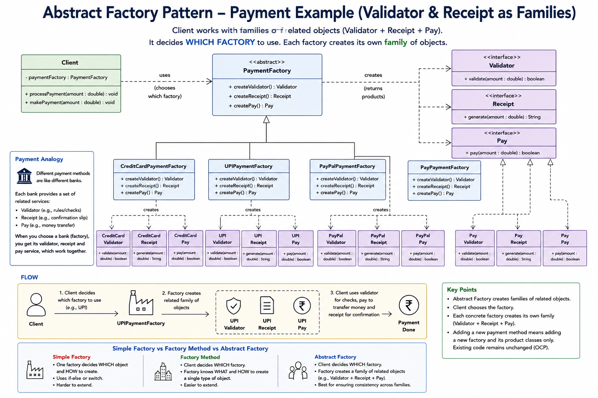

##
SIMPLE FACTORY
PaymentFactory.create("upi") → UPIPayment
One method, one product, string decides

FACTORY METHOD
UPIProcessor.createPayment() → UPIPayment
One method per class, one product, class decides

ABSTRACT FACTORY
UPIFactory.createPayment()   → UPIPayment
UPIFactory.createValidator() → UPIValidator     ← family
UPIFactory.createReceipt()   → UPIReceipt
Multiple methods, whole family, factory decides

##
Extension of Factory here instead of 1 method the factory handles a family of related objects.