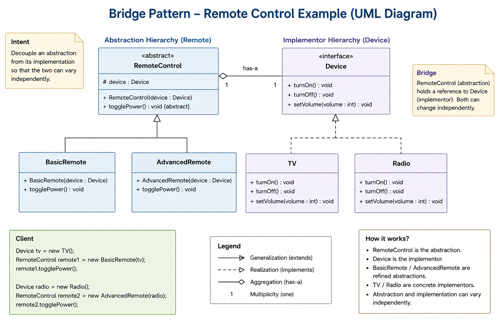

### 🔵 Bridge Pattern – Remote Example (Small Definition)

The **Bridge Design Pattern** in the Remote Control example **decouples the remote (abstraction) from the device (implementation)** so that both can vary independently.

👉 A `RemoteControl` defines actions like `togglePower()`, while different `Device` types (TV, Radio) define how those actions are executed.

✔ This allows you to mix and match:

* Different remotes (Basic / Advanced)
* With different devices (TV / Radio)

👉 In simple words:
**“Remote controls *what to do*, device defines *how it is done*.”**
