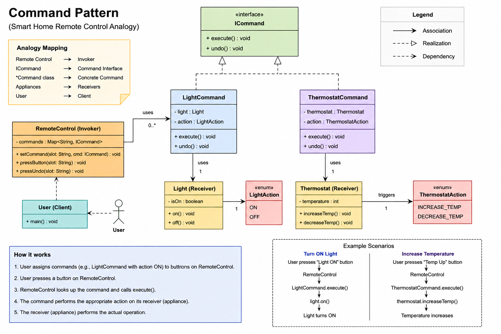

##
This helps us to create a middleware to decouple things,
we can make controller configurable and use the command object
to add incorporate async, logging and other things as well.

Mainly helps with execute and undo type things.

The three key decouplings it buys you:

The caller (hub) never knows which device it's controlling

The device never knows who triggered it

The action becomes a first-class object — so you can queue it, log it, undo it, or bundle it into a macro

When to reach for it:

You need undo/redo

You need to queue or schedule actions

You need macro commands (one trigger → many actions)

You want to log or replay what happened