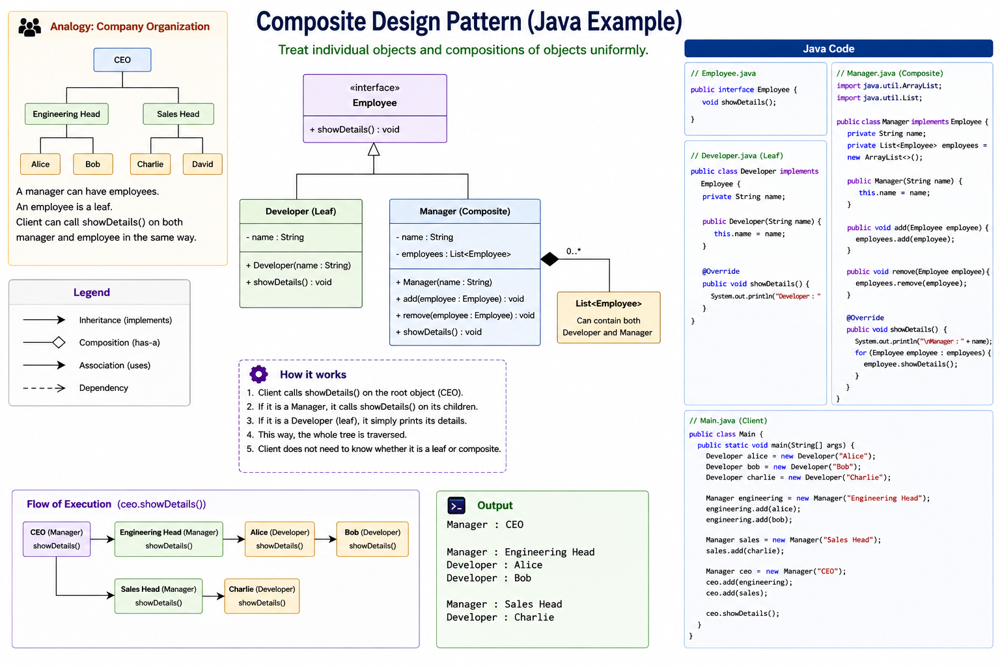

##
Composite Pattern is used when objects naturally form a tree structure and clients should be able to work with both individual objects and groups uniformly. It achieves this by defining a common component interface implemented by both leaf and composite objects.