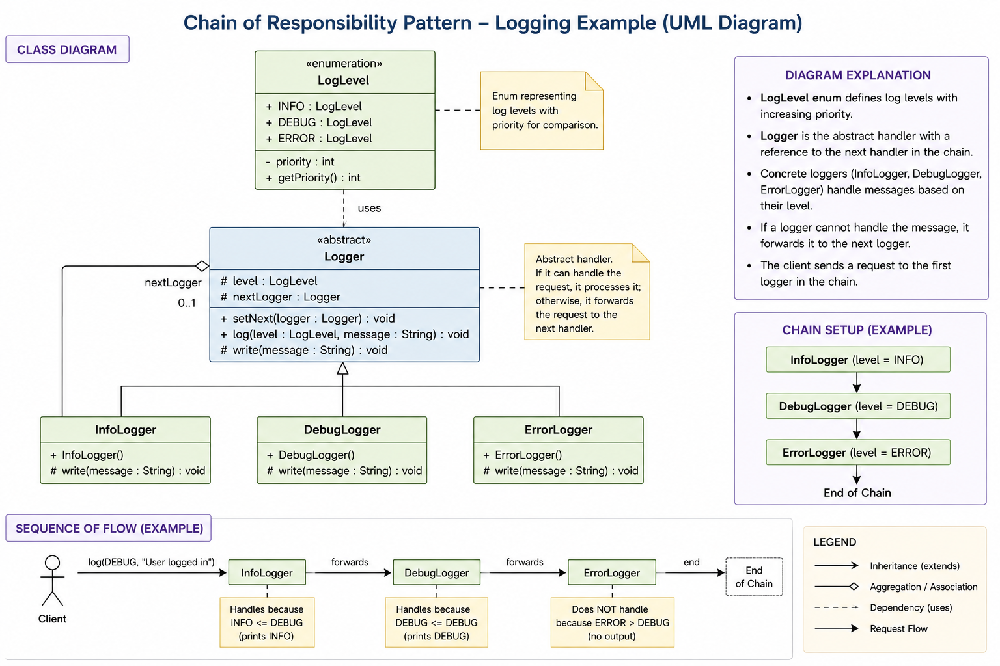

Chain of Responsibility (COR) – Summary
It is a behavioral design pattern
A request is passed through a chain of handlers
Each handler:
either processes the request
or forwards it to the next handler
The sender doesn’t know which object will handle the request
It helps avoid tight coupling between sender and receiver
🧠 In simple words:

👉 “Pass the request along a chain until someone handles it.”