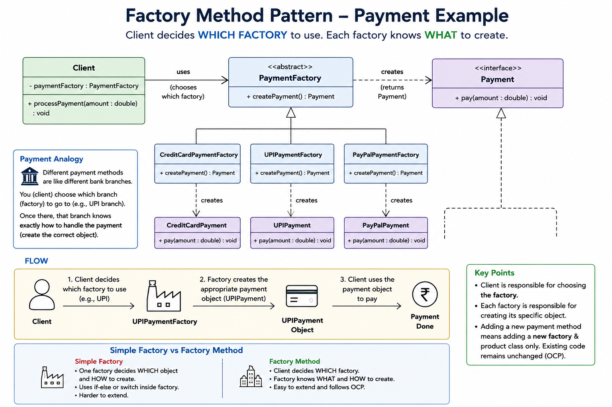

##
Here factory is abstract and child decide which object to create and creation logic resides with individual children.
The if else selection logic goes 1 step up and done by client and for new type directly add new factory child and modify selection choices in client code(no open/close here [trade-off but better logic encapsulation and management]).