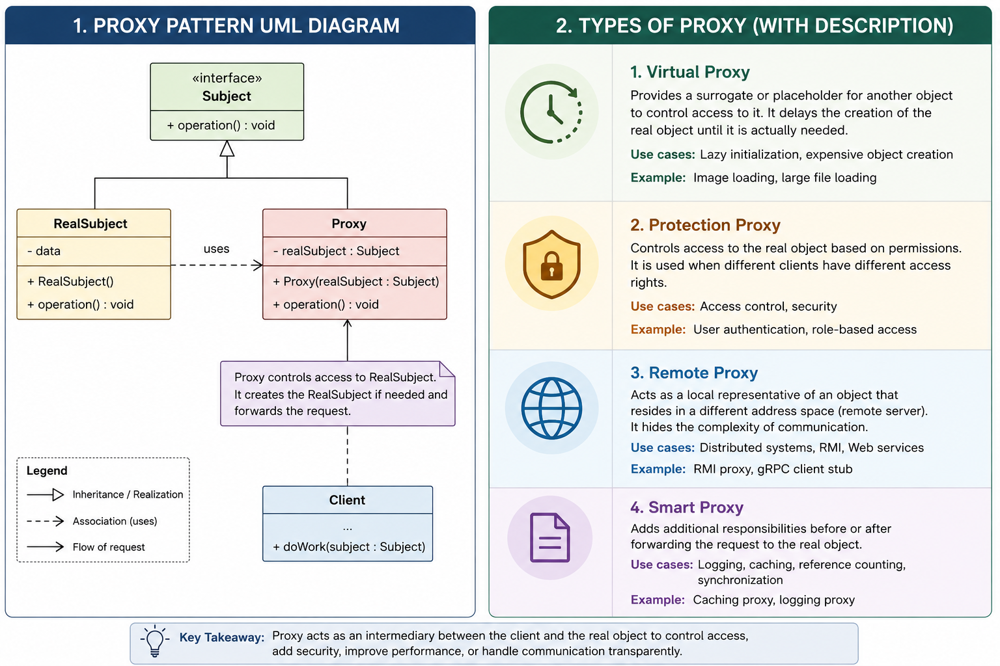

Proxy is like adding a middleware which gives us the power
to control the actual objects access and various other things.

But the client experience does not change for them, they are as usual 
hitting the proxy thinking of it as the actual service.