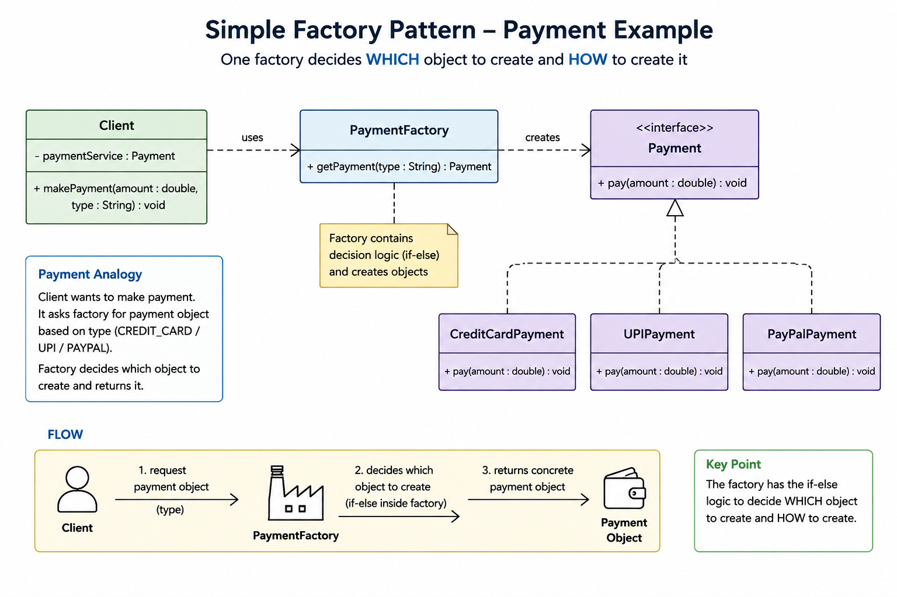

##
Here single factory class has the responsibility to decide and create the object as well which can bloat the class if
more types added also the class need to be modified for adding new type,
violating open/close.