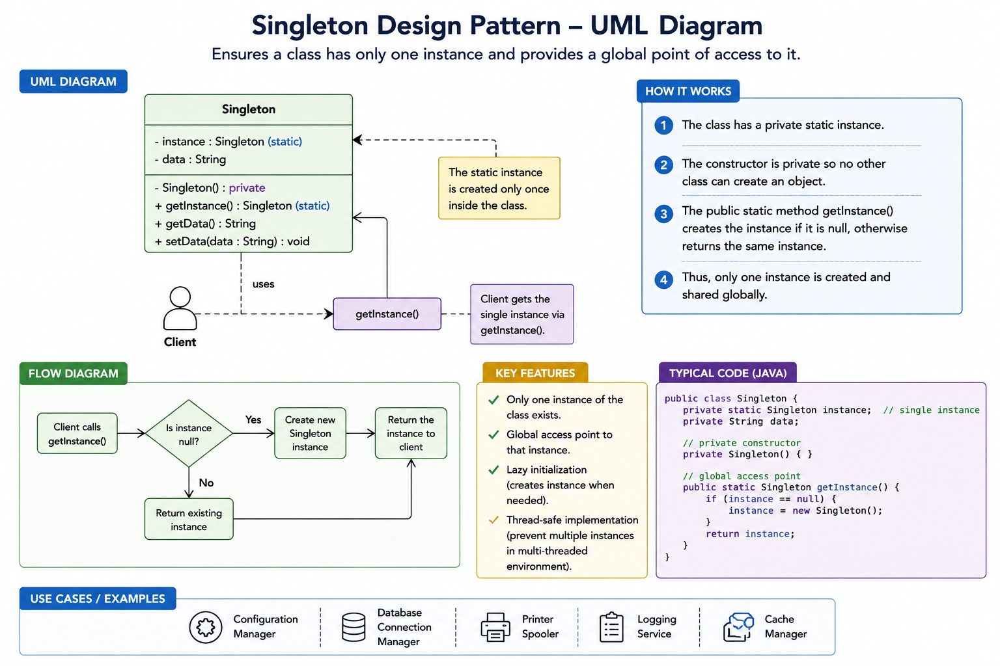

##
Maintain a single object throughout the flow.
e.g- db connection, logger etc. where creating multiple 
objects is an overhead and not logical.
##
EagerSimple app, small object, always needed
#
LazyObject is heavy, may not be needed
#
Single LockLow traffic, simplicity over performance
#
Double CheckedHigh concurrency, performance matters, avoids default locking of critical section