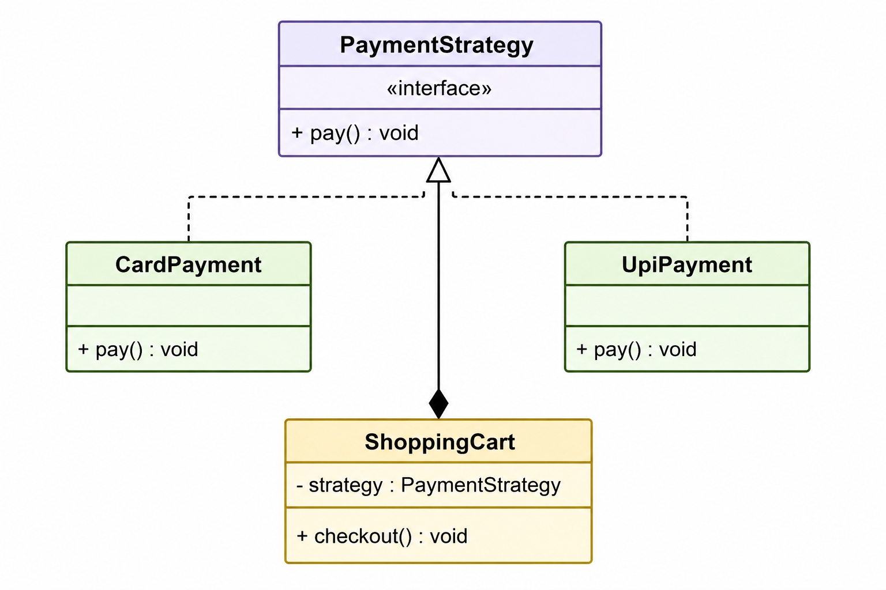

###
Instead of using composition we can use aggregation for shopping to payment.
If we are assuming no other product apart from shopping cart then composition is fine since we won't need payment if no shopping cart.
But in case it's a generic service module aggregation makes more sense.